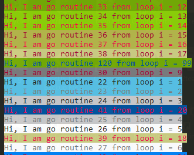
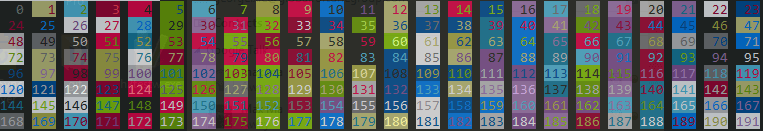

# Colored Goroutines


`import "github.com/xiegeo/coloredgoroutine"`

Just replace 
```
var logger = log.New(os.Stdout, "logger: ", log.Lshortfile)
```
with
```
var logger = log.New(coloredgoroutine.Colors(os.Stdout), "logger: ", log.Lshortfile)
```

So you can easily remove it when you are done debugging and no one will know.

Sample output:



Color template:



Bigger numbered go routines will repeat the colors. 
